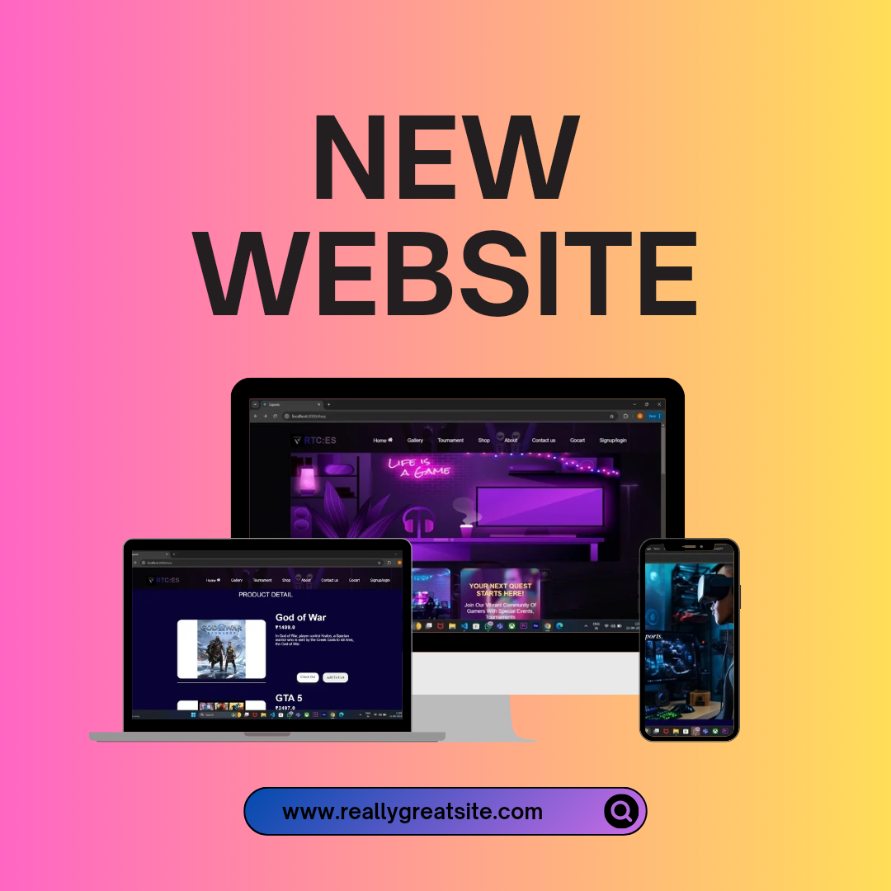

# eSports Tournament Website

## Overview
This project is an eSports website designed for the gaming community, featuring tournament registration, custom registration options, and a shop section for purchasing games at reduced prices.

## Features
- *Tournament Registration*: Users can register for various eSports tournaments.
- *Custom Registration*: Personalized registration options for players.
- *Shop Section*: Purchase popular games at lower costs.
## Example Screenshot of Website.

## Target Audience
This website is aimed at the gaming community, particularly players interested in participating in tournaments and finding affordable game options.

## Installation
To run this project locally, follow these steps:

1. Clone the repository:
   bash
   git clone https://github.com/yourusername/esports-website.git
   
2. Navigate into the project directory:
   bash
   cd esports-website
   
3. Install dependencies:
   bash
   npm install
   
4. Start the development server:
   bash
   npm start
   

## Usage
1. Visit the homepage to view upcoming tournaments.
2. Navigate to the registration page to sign up for tournaments.
3. Explore the shop to purchase games.

## Technologies Used
- HTML
- CSS
- JavaScript
- React

## License
This project is licensed under the MIT License. See the [LICENSE](LICENSE) file for more details.

## How to contribute ##
Contributions are welcome! Please create a pull request or open an issue for any suggestions.

1. Fork the repository to your Github account.
2. Make your changes, add new content, or fix any existing issues.
3. open a new pull request in this repository.
## Contributers ##

Made with [contrib.rocks](https://contrib.rocks).

## Contact
For questions or feedback, reach out to [your-email@example.com](mailto:your-email@example.com).

### Notes:
- Adjust the repository URL and contact email as needed.
- You can expand sections like Features or Usage with more details if you want.
- Feel free to convert this Markdown to HTML if you prefer that format!